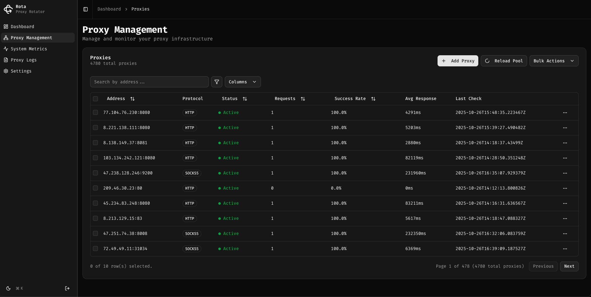

<div align="center" style="margin-bottom: 20px;">
  
  <h1 align="center">
  Rota - Proxy Rotation Platform
  </h1>
</div>

<p align="center">
<a href="https://opensource.org/licenses/Apache-2.0"></a>
<a href="https://golang.org"></a>
<a href="https://nextjs.org"></a>
<a href="https://www.timescale.com/"></a>
<a href="https://github.com/alpkeskin/rota/releases"></a>
<a href="https://github.com/alpkeskin/rota/actions"></a>
</p>





## 🎯 Overview

**Rota** is a modern, full-stack proxy rotation platform that combines enterprise-grade proxy management with a beautiful, real-time web dashboard. Built with performance and scalability in mind, Rota handles thousands of requests per second while providing comprehensive monitoring, analytics, and control through an intuitive interface.

Whether you're conducting web scraping operations, performing security research, load testing, or need reliable proxy management at scale, Rota delivers a complete solution with:

- **High-Performance Core**: Lightning-fast Go-based proxy server with intelligent rotation strategies
- **Real-Time Dashboard**: Modern Next.js web interface with live metrics and monitoring
- **Time-Series Analytics**: TimescaleDB-powered storage for historical analysis and insights
- **Production-Ready**: Docker-based deployment with health checks, graceful shutdown, and monitoring

---

## ✨ Key Features

### Core Proxy Server
- 🚀 **High Performance**: Handle thousands of concurrent requests with minimal latency
- 🔄 **Smart Rotation**: Multiple rotation strategies (random, round-robin, least connections, time-based)
- 🤖 **Automatic Management**: Real-time proxy pool monitoring with automatic unhealthy proxy removal
- 🌍 **Multi-Protocol**: Full support for HTTP, HTTPS, SOCKS4, SOCKS4A, and SOCKS5
- ✅ **Health Checking**: Built-in proxy validation to maintain a healthy pool
- 🔒 **Authentication**: Basic auth support for proxy server
- ⚡ **Rate Limiting**: Configurable rate limiting to prevent abuse
- 🔗 **Proxy Chaining**: Compatible with upstream proxies (Burp Suite, OWASP ZAP, etc.)
- ⏱️ **Configurable Timeouts**: Fine-grained control over request timeouts and retries
- 🔁 **Redirect Support**: Optional HTTP redirect following

### Web Dashboard
- 📊 **Real-Time Metrics**: Live statistics, charts, and system monitoring
- 🔄 **Proxy Management**: Add, edit, delete, and test proxies through the UI
- 📝 **Live Logs**: WebSocket-based real-time log streaming
- 💻 **System Monitoring**: CPU, memory, disk, and runtime metrics
- ⚙️ **Configuration**: Manage settings through the web interface
- 🎨 **Modern UI**: Beautiful, responsive design with dark mode support
- 📱 **Mobile-Friendly**: Fully responsive across all devices

### Data & Analytics
- 📈 **Time-Series Storage**: TimescaleDB for efficient historical data storage
- 🔍 **Request History**: Track all proxy requests with detailed metadata
- 📉 **Performance Analytics**: Analyze proxy performance over time
- 🎯 **Usage Insights**: Understand traffic patterns and proxy utilization

### DevOps & Deployment
- 🐳 **Docker-Native**: Production-ready containerized deployment
- 🔧 **Easy Configuration**: Environment-based configuration
- 🏥 **Health Checks**: Built-in health endpoints for monitoring
- 🛑 **Graceful Shutdown**: Clean shutdown with connection draining
- 📊 **Observability**: Structured JSON logging and metrics endpoints

---

## 🚀 Quick Start

### Using Docker Compose (Recommended)

The fastest way to get Rota up and running:

```bash
# Clone the repository
git clone https://github.com/alpkeskin/rota.git
cd rota

# Start all services (core, dashboard, database)
docker compose up -d

# Check service status
docker compose ps
```

**Access the services:**
- 🌐 **Dashboard**: http://localhost:3000
- 🔧 **API**: http://localhost:8001
- 🔄 **Proxy**: http://localhost:8000
- 🗄️ **Database**: localhost:5432

**Default credentials for dashboard:**
- Username: `admin`
- Password: `admin`

### Using Docker

Pull and run the core service:

```bash
# Pull from GitHub Container Registry
docker pull ghcr.io/alpkeskin/rota:latest

# Run with basic configuration
docker run -d \
  --name rota-core \
  -p 8000:8000 \
  -p 8001:8001 \
  -e DB_HOST=your-db-host \
  -e DB_USER=rota \
  -e DB_PASSWORD=your-password \
  ghcr.io/alpkeskin/rota:latest
```

### From Source

```bash
# Prerequisites: Go 1.25.3+, Node.js 20+, PostgreSQL 16+ with TimescaleDB

# Clone the repository
git clone https://github.com/alpkeskin/rota.git
cd rota

# Start Core
cd core
cp .env .env.local  # Configure your environment
make install
make dev

# Start Dashboard (in new terminal)
cd dashboard
npm install
cp .env.local .env.local  # Configure API URL
npm run dev
```

### Testing the Proxy

```bash
# Route traffic through Rota proxy
curl -x http://localhost:8000 https://api.ipify.org?format=json

# Using environment variables
export HTTP_PROXY=http://localhost:8000
export HTTPS_PROXY=http://localhost:8000
curl https://api.ipify.org?format=json
```

---

## 📚 API Documentation

### Interactive API Documentation (Swagger)

Rota provides interactive API documentation through Swagger UI. Once the core service is running, you can access it at:

```
http://localhost:8001/docs
```

The Swagger interface allows you to:
- 📖 Browse all available API endpoints
- 🧪 Test API requests directly from your browser
- 📝 View request/response schemas
- 🔍 Explore authentication requirements

**Quick Access:**
- **Swagger UI**: http://localhost:8001/docs
- **OpenAPI Spec**: http://localhost:8001/docs/swagger.json

---

## 🏗️ Architecture

Rota is built as a modern monorepo with three main components:

```
┌─────────────────────────────────────────────────────────────┐
│                        Rota Platform                        │
├─────────────────────────────────────────────────────────────┤
│                                                             │
│  ┌──────────────┐    ┌──────────────┐    ┌──────────────┐   │
│  │   Dashboard  │───▶│  Core (API)  │───▶│ TimescaleDB  │   │
│  │   Next.js    │    │     Go       │    │  PostgreSQL  │   │
│  │  Port 3000   │    │  Port 8001   │    │  Port 5432   │   │
│  └──────────────┘    └──────────────┘    └──────────────┘   │
│         │                    │                              │
│         │                    ▼                              │
│         │            ┌──────────────┐                       │
│         └───────────▶│ Proxy Server │                       │
│                      │      Go      │                       │
│                      │  Port 8000   │                       │
│                      └──────────────┘                       │
│                              │                              │
└──────────────────────────────┼──────────────────────────────┘
                               ▼
                     ┌──────────────────┐
                     │   Proxy Pool     │
                     │  (External IPs)  │
                     └──────────────────┘
```

---

### Rotation Strategies


- **Random**: Select a random proxy for each request
- **Round Robin**: Distribute requests evenly across all proxies
- **Least Connections**: Route to the proxy with fewest active connections
- **Time-Based**: Rotate proxies at fixed intervals

---

## 🐳 Deployment

### Production Deployment

#### Using Docker Compose

```bash
# Production configuration
docker compose -f docker-compose.yml up -d

# Enable auto-restart
docker compose up -d --restart=unless-stopped
```
---

## 🤝 Contributing

Contributions are welcome! We appreciate meaningful contributions that add value to the project.

### How to Contribute

1. **Fork the repository**
2. **Create a feature branch**: `git checkout -b feature/amazing-feature`
3. **Make your changes**
4. **Commit your changes**: `git commit -m 'Add amazing feature'`
5. **Push to the branch**: `git push origin feature/amazing-feature`
6. **Open a Pull Request**

### Contribution Guidelines

- Write clear, descriptive commit messages
- Add tests for new features
- Update documentation as needed
- Follow existing code style and conventions
- Ensure all tests pass before submitting PR
- One feature/fix per pull request

**Note**: Pull requests that do not contribute significant improvements or fixes will not be accepted.

### Development Workflow

```bash
# 1. Create feature branch
git checkout -b feature/my-feature

# 2. Make changes and test
make test

# 3. Commit changes
git add .
git commit -m "feat: add my feature"

# 4. Push and create PR
git push origin feature/my-feature
```

---

## 📝 License

This project is licensed under the Apache License 2.0 - see the [LICENSE](LICENSE) file for details.

---

<div align="center">
  <p>
    <sub>Built with ❤️ by <a href="https://github.com/alpkeskin">Alp Keskin</a></sub>
  </p>
  <p>
    <sub>⭐ Star this repository if you find it useful!</sub>
  </p>
</div>
